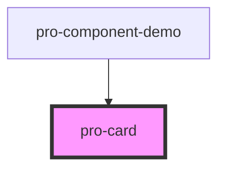

# pro-card

<!-- Auto Generated Below -->

## Properties

| Property   | Attribute  | Description | Type                              | Default     |
| ---------- | ---------- | ----------- | --------------------------------- | ----------- |
| `button`   | `button`   |             | `boolean`                         | `false`     |
| `disabled` | `disabled` |             | `boolean`                         | `false`     |
| `href`     | `href`     |             | `string`                          | `undefined` |
| `rel`      | `rel`      |             | `string`                          | `undefined` |
| `target`   | `target`   |             | `string`                          | `undefined` |
| `type`     | `type`     |             | `"button" \| "reset" \| "submit"` | `'button'`  |

## Dependencies

### Used by

 - [pro-component-demo](../pro-component-demo)

### Graph

----------------------------------------------

*Built with [StencilJS](https://stenciljs.com/)*
