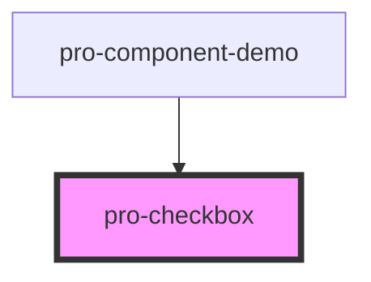

# pro-checkbox

<!-- Auto Generated Below -->

## Properties

| Property             | Attribute  | Description | Type      | Default     |
| -------------------- | ---------- | ----------- | --------- | ----------- |
| `checked`            | `checked`  |             | `boolean` | `false`     |
| `disabled`           | `disabled` |             | `boolean` | `false`     |
| `name` _(required)_  | `name`     |             | `string`  | `undefined` |
| `value` _(required)_ | `value`    |             | `any`     | `undefined` |

## Events

| Event       | Description | Type               |
| ----------- | ----------- | ------------------ |
| `proChange` |             | `CustomEvent<any>` |
| `proStyle`  |             | `CustomEvent<any>` |

## Dependencies

### Used by

 - [pro-component-demo](../pro-component-demo)

### Graph

----------------------------------------------

*Built with [StencilJS](https://stenciljs.com/)*
