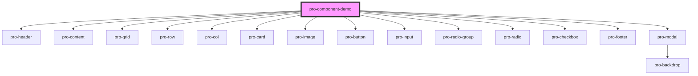

# my-component

<!-- Auto Generated Below -->

## Dependencies

### Depends on

- [pro-header](../pro-header)
- [pro-content](../pro-content)
- [pro-grid](../pro-grid)
- [pro-row](../pro-row)
- [pro-col](../pro-col)
- [pro-card](../pro-card)
- [pro-image](../pro-image)
- [pro-button](../pro-button)
- [pro-input](../pro-input)
- [pro-radio-group](../pro-radio-group)
- [pro-radio](../pro-radio)
- [pro-checkbox](../pro-checkbox)
- [pro-footer](../pro-footer)
- [pro-modal](../pro-modal)

### Graph

----------------------------------------------

*Built with [StencilJS](https://stenciljs.com/)*
