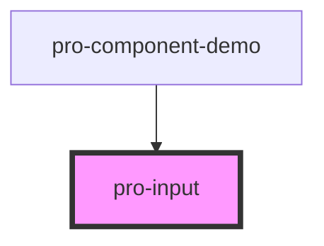

# pro-input

<!-- Auto Generated Below -->

## Properties

| Property      | Attribute     | Description | Type      | Default     |
| ------------- | ------------- | ----------- | --------- | ----------- |
| `label`       | `label`       |             | `string`  | `undefined` |
| `placeholder` | `placeholder` |             | `string`  | `undefined` |
| `regex`       | --            |             | `RegExp`  | `/^(.+)$/`  |
| `required`    | `required`    |             | `boolean` | `false`     |

## Events

| Event         | Description | Type               |
| ------------- | ----------- | ------------------ |
| `inputChange` |             | `CustomEvent<any>` |

## Dependencies

### Used by

 - [pro-component-demo](../pro-component-demo)

### Graph

----------------------------------------------

*Built with [StencilJS](https://stenciljs.com/)*
