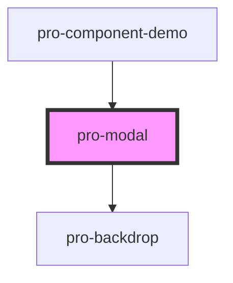

# pro-modal

<!-- Auto Generated Below -->

## Methods

### `dismiss() => Promise<void>`

#### Returns

Type: `Promise<void>`

### `present() => Promise<void>`

#### Returns

Type: `Promise<void>`

## Dependencies

### Used by

 - [pro-component-demo](../pro-component-demo)

### Depends on

- [pro-backdrop](../pro-backdrop)

### Graph

----------------------------------------------

*Built with [StencilJS](https://stenciljs.com/)*
