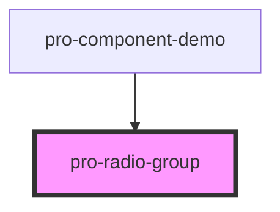

# pro-radio-group

<!-- Auto Generated Below -->

## Properties

| Property            | Attribute | Description | Type     | Default     |
| ------------------- | --------- | ----------- | -------- | ----------- |
| `name` _(required)_ | `name`    |             | `string` | `undefined` |
| `value`             | `value`   |             | `string` | `undefined` |

## Dependencies

### Used by

 - [pro-component-demo](../pro-component-demo)

### Graph

----------------------------------------------

*Built with [StencilJS](https://stenciljs.com/)*
