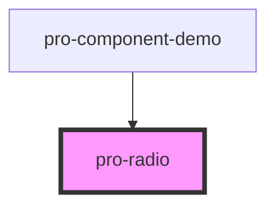

# pro-radio

<!-- Auto Generated Below -->

## Properties

| Property             | Attribute  | Description | Type      | Default                |
| -------------------- | ---------- | ----------- | --------- | ---------------------- |
| `checked`            | `checked`  |             | `boolean` | `false`                |
| `disabled`           | `disabled` |             | `boolean` | `false`                |
| `name`               | `name`     |             | `string`  | `'default-radio-name'` |
| `value` _(required)_ | `value`    |             | `any`     | `undefined`            |

## Events

| Event               | Description | Type                |
| ------------------- | ----------- | ------------------- |
| `proDeselect`       |             | `CustomEvent<any>`  |
| `proRadioDidLoad`   |             | `CustomEvent<void>` |
| `proRadioDidUnload` |             | `CustomEvent<void>` |
| `proSelect`         |             | `CustomEvent<any>`  |
| `proStyle`          |             | `CustomEvent<any>`  |

## Dependencies

### Used by

 - [pro-component-demo](../pro-component-demo)

### Graph

----------------------------------------------

*Built with [StencilJS](https://stenciljs.com/)*
